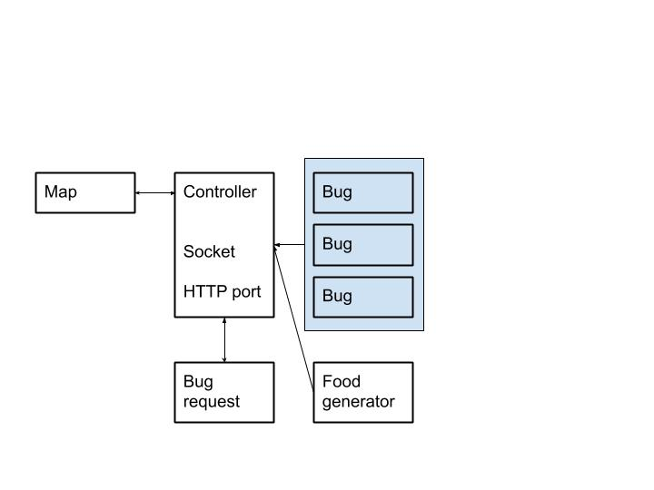

The program can be decoupled like this:

At the center there's a controller which has two network access: socket and http.
Socket is used for internal process communication(IPC). There's a map, which is a state machine to save current state of the map (food, bug, fields, etc). Controller will have a reference of it (meaning not well decoupled and we can decouple later). There are a bunch of bugs each run on a individual thread. They communicates with controller through socket. There's also a food generator, which communicates with controller through socket.

In the main function, a controller will be created with a map, then it waits for the first bug request:
* controller will create a default food generator
* bug requst comes in, controller creates a bug in a separate thread.
* controller creates a bug according to the bug request and start running the program.
* In each round, controller will send each of the bugs their vision and current food
* bugs makes their decision based on their state and responds to controller
* controller also sends a request to food generator, food generator also sends info to controller.
* everyone's info will be collected with a timeout
* controller sends these info to map and map do update accordingly
* the round will proceed with one step, controller sends new info to bugs and food generator and repeat.

Note:
* when bugs send info to controller, they also send a hashcode as verification. In the next round, controller will send this hashcode back. If hashcode not right, bug will not do the update as previous round.
* Previous functionality should be identical for all socket clients. So it's necessary to create an abstract client class.
* It also means that bugs propose the changes and only commit changes if server verified.
